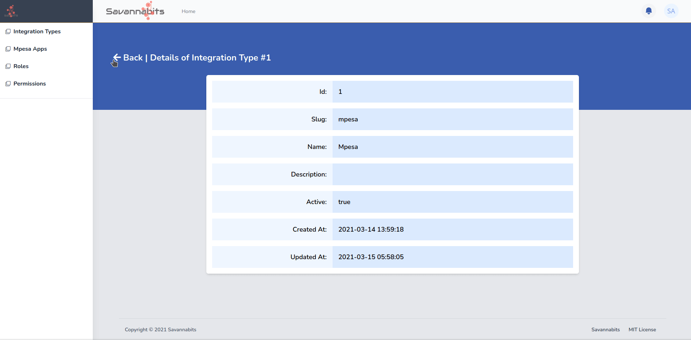
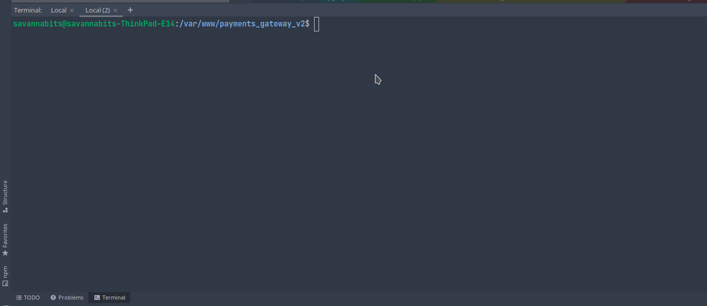

# Jetstream Powered Admin CRUD Generator

[](https://packagist.org/packages/savannabits/jetstream-inertia-generator)


[](https://packagist.org/packages/savannabits/jetstream-inertia-generator)

**Jetstream Inertia Generator** a.k.a **jig** allows you to generate code for simple Admin CRUDs (Create, Read, UPdate, Delete) which are fully compatible with a Laravel Project powered by the [Jetstream - Inertia - Vue.js](https://jetstream.laravel.com/2.x/stacks/inertia.html) Stack.

## Scenario
You are developing a NextGen project. The data model is complex. It requires **Many CRUDS** managed by the admin in order to power the main end-user functionality. You don't want to spend **Days or even Months** writing boilerplate code for all the CRUDs.
If that is you, this package comes to your rescue. Just follow these simple steps:

* Generate a Migration for your CRUD table, e.g articles, and run `php artisan migrate` (About **2 minutes**)
* With this package, just run `php artisan jig:generate articles` (About **3 seconds!!!**)
* Build your css and javascript (About **27 seconds**)
DONE! In about **2 and a half minutes**, you get a fully working module consisting of -:
- Model
- Admin Controller - Index, Create, Show, Edit, Store, Update, Delete
- API Controller - Index, Store, Show, Update, Delete
- An Authorization Policy - viewAny, view, create, update, delete, restore, forceDelete
- Generated Permissions for [spatie/laravel-permissions](https://spatie.be/docs/laravel-permission/v4/introduction) - articles, articles.index, articles.create, articles.show, articles.edit, articles.delete
- Frontend Menu entry
- Frontend Datatable with Actions thanks to Using Yajra Datatables and datatables.net
- Tailwindcss-powered CREATE and EDIT forms,
- Tailwindcss - powered SHOW view.
- web and API routes
- Validation and Authorization Request Classes

What more could you ask for? Cut a day's work down to less than 3 minutes.

## Dependencies
If you have followed the [Jetstream - Inertia - Vue.js Installation](https://jetstream.laravel.com/2.x/stacks/inertia.html) instructions, then the project will work with minimal configuration.
Other Important dependencies that you MUST configure include:
1. [Spatie Laravel Permissions](https://spatie.be/docs/laravel-permission/v4/introduction) - This is used to manage roles and permissions. Its migrations will be published during asset publishing, after which you can go ahead and configure the user trait.
2. [Laravel Sanctum](https://laravel.com/docs/8.x/sanctum) - Used to manage both API and stateful authentication. Since the whole app will be a Single Page Application, make sure you configure the middleware sanctum middleware in `app/Http/Kernel.php` as follows:
```php
'api' => [
    \Laravel\Sanctum\Http\Middleware\EnsureFrontendRequestsAreStateful::class,
    ...
],
```

## Installation
1. You can install the package via composer:
```bash
composer require savannabits/jetstream-inertia-generator
```
2. Install the necessary `npm` dev dependencies by running the following command:

If you are using npm:
```shell
npm run --dev pagetables popper.js @babel/plugin-syntax-dynamic-import dayjs dotenv numeral portal-vue postcss postcss-import pusher-js laravel-echo sass sass-loader vue3-vt-notifications vue-flatpickr-component  vue-numerals vue-pdf mitt "https://github.com/sagalbot/vue-select/tarball/feat/vue-3-compat"
```
Or if you are using yarn:
```shell
yarn add -D pagetables popper.js @babel/plugin-syntax-dynamic-import dayjs dotenv numeral portal-vue postcss postcss-import pusher-js laravel-echo sass sass-loader vue3-vt-notifications vue-flatpickr-component  vue-numerals vue-pdf mitt "https://github.com/sagalbot/vue-select/tarball/feat/vue-3-compat"
```
3. Ensure your webpack mix is properly configured to support [code splitting](https://inertiajs.com/client-side-setup). Check that the `webpack.config.js` file matches or is close to the following:
```js
const path = require('path');
require('dotenv').config();

module.exports = {
    resolve: {
        alias: {
            '@': path.resolve('resources/js'),
        },
    },
    output: {
        chunkFilename: `js/chunks/[name].js?id=[chunkhash]`,
        filename: "[name].js?id=[chunkhash]",
        publicPath: `/${process.env.MIX_APP_URI ? process.env.MIX_APP_URI+'/' : ''}`
    }
};

```

4.Ensure tailwind.config.js is present and has the correct configuration, including the @tailwindcss/forms plugin, and all the necessary paths for purge. Here is my recommendation:
   
```javascript
const defaultTheme = require('tailwindcss/defaultTheme');
const colors  = require("tailwindcss/colors");
module.exports = {
    purge: [
        './vendor/laravel/framework/src/Illuminate/Pagination/resources/views/*.blade.php',
        './vendor/laravel/jetstream/**/*.blade.php',
        './storage/framework/views/*.php',
        './resources/views/**/*.blade.php',
        './resources/js/**/*.vue',
    ],

    theme: {
        extend: {
            fontFamily: {
                sans: ['Nunito', ...defaultTheme.fontFamily.sans],
            },
            colors: {
                info: colors.blue["300"],
                primary: {...colors.indigo,DEFAULT: colors.indigo["500"]},//Your colors here...
                secondary: {...colors.gray,DEFAULT: colors.gray["500"]},
                warning: {
                    ...colors.yellow,
                    DEFAULT: colors.yellow["500"]
                },
                danger: {
                    ...colors.red,
                    DEFAULT: colors.red["500"]
                },
                success: {
                    ...colors.green,
                    DEFAULT: colors.green["500"]
                },
            },
        },
    },

    variants: {
        extend: {
            opacity: ['disabled'],
            width: ["responsive", "hover", "focus"],
            height: ["responsive", "hover", "focus"],
            objectFit: ["responsive", "hover", "focus"],
            borderRadius: ["hover","focus"]
        },
    },

    plugins: [require('@tailwindcss/forms'), require('@tailwindcss/typography')],
};

```
Feel free to configure the color palette to your own preference, but for uniformity be sure to include `primary`,`secondary`, `success` and `danger` variants since they are used in the jig template.
5. Publish the Package's assets and views. This is necessary for you to get the admin layout and all the vue components used in the generated code:
```shell
php artisan vendor:publish --tag=jig-blade-templates --force #Publishes resources/views/app.blade.php. If it already exists, use --force to replace it
php artisan vendor:publish --tag=jig-config #Publishes the config file
php artisan vendor:publish --tag=jig-routes #Publishes routes/jig.php to hold routes for generated modules.
php artisan vendor:publish --tag=jig-views #publishes Vue Components and Layout files
php artisan vendor:publish --tag=jig-assets #publishes logos and other assets
```

6. Then finish installation steps for spatie/laravel-permission by publishing its migrations.
```shell
php artisan vendor:publish --provider="Spatie\Permission\PermissionServiceProvider"
```
NB: If you had already separately published laravel-permission's migrations, then you need to modify both the `roles` and `permissions` tables and add a nullable `title` field to each. This is used especially when scaffolding permissions for each generated module.

7. Add the `JigMiddleware` to the Global middleware group in `app/Http/Kernel.php`:
    ```php
    protected $middleware = [
        ...,
        \Savannabits\JetstreamInertiaGenerator\Middleware\JigMiddleware::class,
    ];
    ```
## Usage
The hard part is over. This is the easy part.
### General Steps to generate a CRUD:

1. Generate and write a migration for your table with `php artisan make:migration` command.
2. Run the migration to the database with `php artisan migrate` command
3. Generate the Whole Admin Scaffold for the module with `php artisan jig:generate` command
4. Modify and customize the generated code to suit your specific requirements if necessary.

### Example
Assuming you want to generate a `books` table:
```shell
php artisan make:migration create_books_table
```
* Open your migration and modify it as necessary, adding your fields. After that, run the migration.
```shell
php artisan migrate
```
* __The Fun Part:__ Scaffold a whole admin module for books with jig using the following command:
```shell
php artisan jig:generate books #Format: php artisan generate [table_name] [-f]
```
__NB:__ To get a full list of `jig` commands called under the hood and the full description of the `jig:generate` command, you can run the following: 
```shell
php artisan jig --help
php artisan jig:generate --help
```
The command above will generate a number of files and add routes to both your `api.php` and `web.php` route files. It will also append menu entries to the published `Menus.json` file.
The generated vue files are placed under the Pages/Books folder in the js folder.

* Finally, run `yarn watch, yarn dev or yarn prod` to compile the assets. There you have your CRUD.
## Roles, permissions and Sidebar Menu:
* By Default, generation of a module generates the following permissions:
    - index
    - create
    - show
    - edit
    - delete
    
* The naming convention for permissions is ${module-name}.${perm} e.g payments.index, users.create etc.
* This package manages access control using policies. Each generated module generates a policy with the default laravel actions:
    - viewAny, view, store, update, delete, restore, forceDelete
  The permissions generated above are checked in these policies. If you need to modify any of the access permissions, policies is where to look.
      
* Special permissions MUST also be generated to control access to the sidebar menus. These permissions SHOULD NOT contain two parts separated with a dot, but only one part.
* Menus are configured in a json file published at `./resources/js/Layouts/Jig/Menu.json`. 
    - For all menu items, the json key MUST match the permision that controls that menu. A permission without any verb is generated when generating each module for this very purpose. For example, generating a `payments` module will generate a `payments` permission.
      Then the menu for payments must have `payments` as the json key.
    - For parent menus and any other menus which may not match any module, you have to create a permission with the key name to control its access. For example, if you have a parent menu called `master-data` you have to generate a permission with the same name.

### Testing

``` bash
composer test
```

### Changelog

Please see [CHANGELOG](CHANGELOG.md) for more information what has changed recently.

## Contributing

Please see [CONTRIBUTING](CONTRIBUTING.md) for details.

### Security

If you discover any security related issues, please email maosa.sam@gmail.com instead of using the issue tracker.

## Credits

- [Sam Maosa](https://github.com/savannabits)
- [All Contributors](../../contributors)

## License

The MIT License (MIT). Please see [License File](LICENSE.md) for more information.
